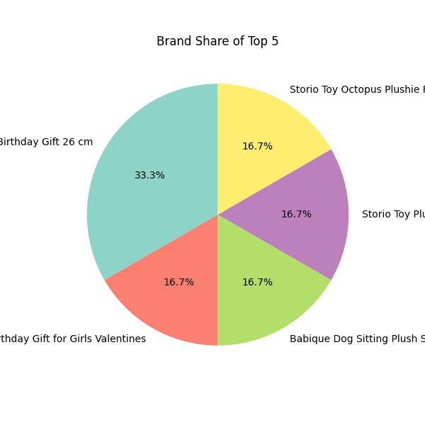

# Amazon Sponsored Product Analyzer

This project scrapes  from [Amazon.in](https://www.amazon.in/) for the keyword **"soft toys"**, cleans and analyzes the data, and visualizes insights such as brand performance, price vs. rating trends, and top-reviewed products.

---

## 🚀 Features

- 📦 Scrape sponsored product data from Amazon using Selenium
- 🧹 Clean and prepare the scraped data (remove duplicates, fix types)
- 📊 Visualize:
  - Top brands by frequency and rating
  - Price vs. Rating analysis
  - Review and rating distribution

---

1. **Clone the repository:**

git clone https://github.com/wndrthndr/Amazon-Analyzer.git
cd Amazon-Analyzer

2.**Install dependencies**:

pip install -r requirements.txt

**3.**Usage**:

3.1.To scrape data : python amazon_sponsor_scraper.py

3.2. To clean and analyse data : python clean_amazon_data.py**

4:**Output**:
 ### 🔝 Top Brands by Frequency

 ### Brand Share 
 

### 💸 Price vs Rating

### 🌟 Most Reviewed Products

